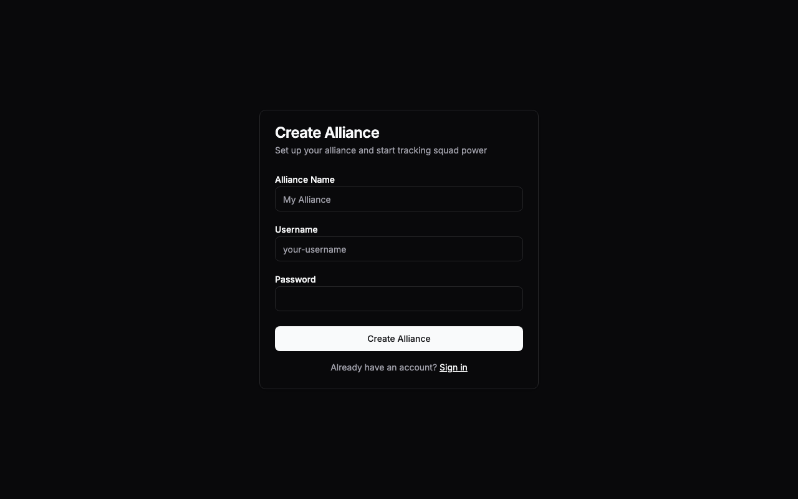
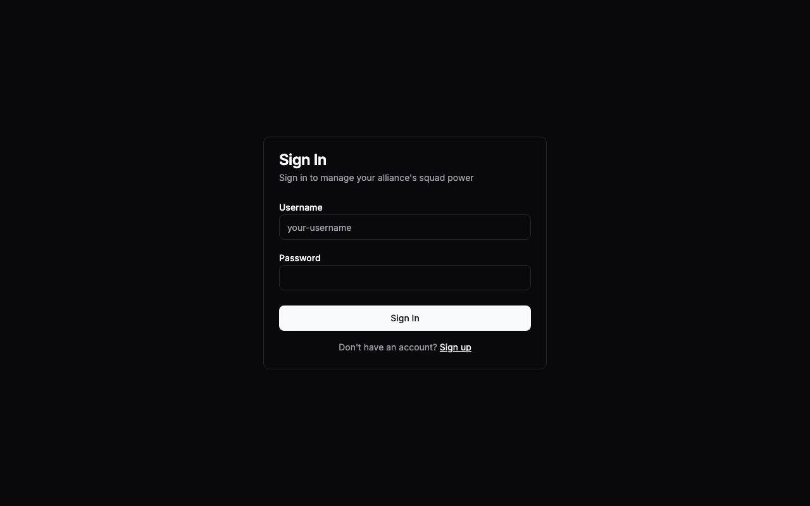
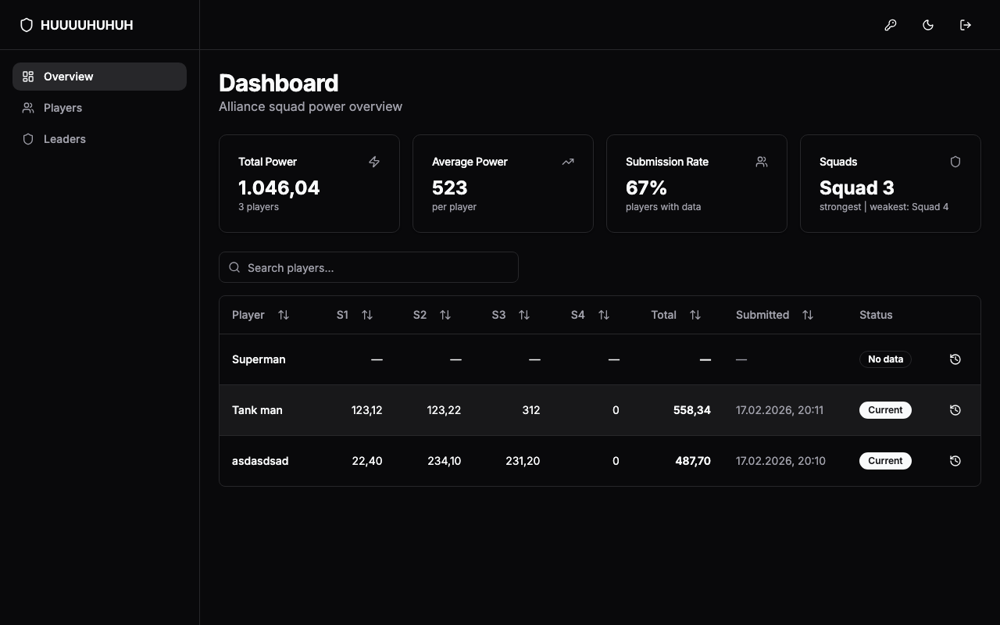
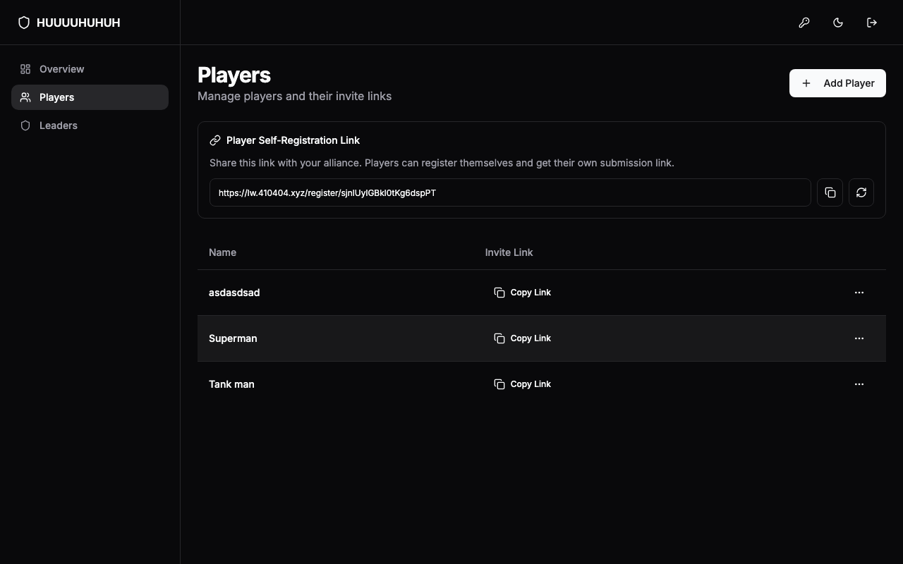
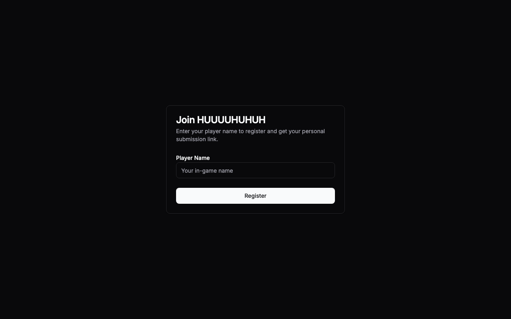
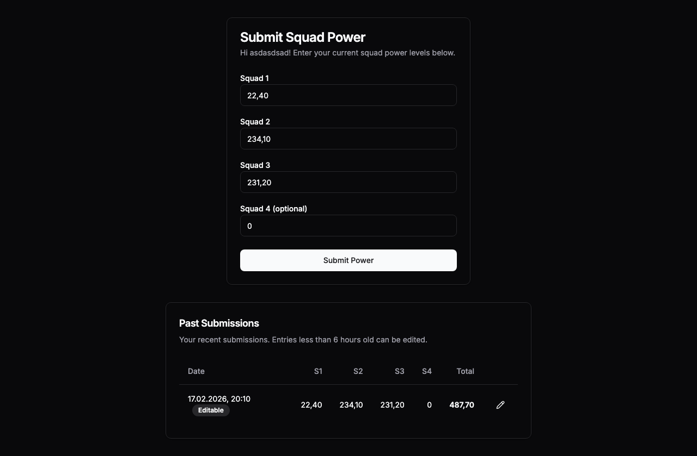
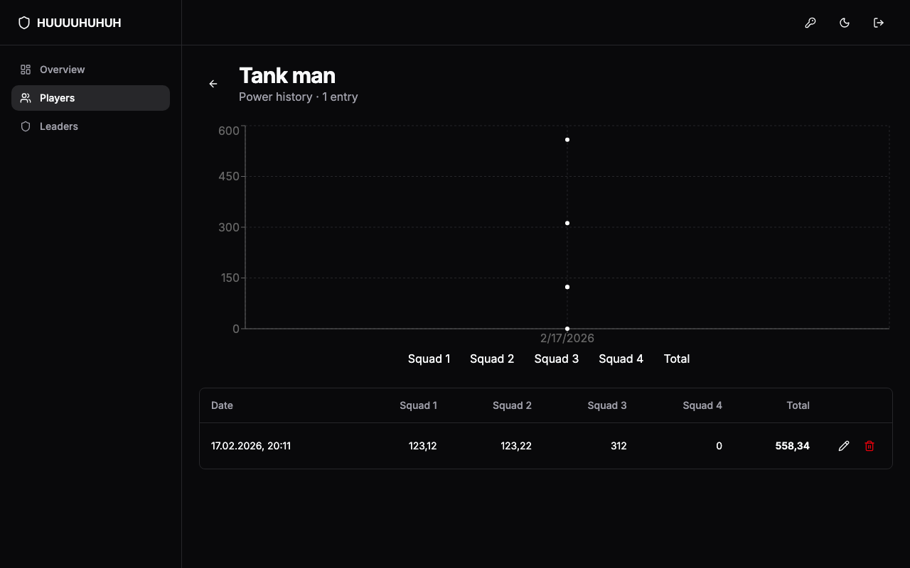
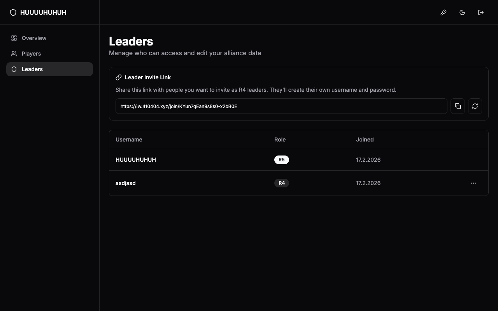

# User Guide

## Getting Started

### Creating an Alliance (R5)

1. Go to the **Sign Up** page
2. Enter your **Alliance Name**, a **Username**, and a **Password**
3. Click **Create Alliance**
4. You are now the R5 (alliance leader) and will be taken to the dashboard

### Logging In

1. Go to the **Login** page
2. Enter your **Username** and **Password**
3. Click **Sign In**

---

## Dashboard Overview

The dashboard shows a summary of your alliance's squad power:

- **Total Power** — combined power of all players who have submitted data
- **Average Power** — average total power per player
- **Submission Rate** — percentage of players who have submitted data
- **Squads** — which squad is strongest and weakest across the alliance

Below the summary cards is a table of all players with their latest squad values, total power, submission date, and status (Current / Stale / No data).

Use the **search bar** to filter players by name. Click any **column header** to sort.

Click the **clock icon** next to any player to view their full submission history.

---

## Managing Players

Navigate to **Players** in the sidebar.

### Adding Players Manually

1. Click **Add Player** in the top right
2. Enter the player's name
3. Click **Add Player**
4. The player appears in the table with a unique submission link

### Player Self-Registration

Instead of adding players one by one, you can share a registration link:

1. On the Players page, find the **Player Self-Registration Link** section
2. Click **Generate Link** (or copy the existing one)
3. Share this link with your alliance members
4. Players open the link, enter their name, and receive their personal submission link

### Player Actions

Each player row has a **three-dot menu** with actions:

- **Copy invite link** — copies the player's unique submission link
- **Edit** — rename a player
- **Regenerate token** — creates a new submission link (old one stops working)
- **Delete** — removes the player and all their submissions

---

## Player Submissions

Players do not need an account. Each player has a unique link that they open in their browser.

### Submitting Power Data

1. Open the submission link
2. Enter power values for **Squad 1**, **Squad 2**, and **Squad 3** (required)
3. **Squad 4** is optional (defaults to 0)
4. Click **Submit Power**
5. A summary shows the submitted values and total power

Values support both decimal formats: `32.12` (English) and `32,12` (German).

There is a **5-minute cooldown** between submissions.

### Editing Recent Submissions

Players can edit their own submissions within **6 hours** of submitting:

1. Below the submission form, find **Past Submissions**
2. Entries less than 6 hours old show an **Editable** badge and a pencil icon
3. Click the pencil to edit values
4. Click **Save Changes**

---

## Managing Submissions (Leaders)

Leaders can edit or delete any submission regardless of age.

### Viewing Player History

1. From the **Dashboard**, click the **clock icon** next to a player
2. The history page shows a **chart** of power trends and a **table** of all submissions

### Editing a Submission

1. In the history table, click the **pencil icon** on any entry
2. Update the squad values in the dialog
3. Click **Save Changes**

### Deleting a Submission

1. In the history table, click the **trash icon** on any entry
2. Confirm the deletion in the dialog
3. The entry is permanently removed

---

## Managing Leaders

Navigate to **Leaders** in the sidebar.

### Roles

- **R5** — Alliance leader. Full access to all features including leader management.
- **R4** — Co-leader. Can manage players, view the dashboard, and change their own password.

### Inviting Co-Leaders (R5 only)

1. On the Leaders page, find the **Leader Invite Link** section
2. Copy the invite link
3. Share it with the person you want to invite
4. They open the link, choose a username and password, and join as R4

### Promoting to R5 (R5 only)

1. In the leaders table, click the **three-dot menu** on an R4 leader
2. Select **Promote to R5**
3. Confirm the action
4. They become R5 and you become R4 (there can only be one R5)

### Resetting a Leader's Password (R5 only)

1. Click the **three-dot menu** on any leader
2. Select **Reset Password**
3. A temporary password is generated and displayed
4. Share the temporary password with the leader — they should change it after logging in

### Removing a Leader (R5 only)

1. Click the **three-dot menu** on an R4 leader
2. Select **Remove**
3. Confirm the action

### Changing Your Own Password

1. Click the **key icon** in the top-right header bar
2. Enter your new password
3. Click **Change Password**

---

## Dark Mode

Click the **theme toggle** (sun/moon icon) in the top-right header to switch between light and dark mode.
